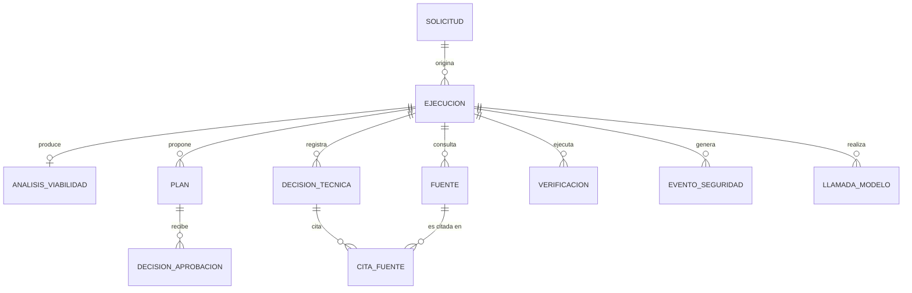

# 02 — Modelo de entidades

| | |
|---|---|
| **Estado** | APROBADO el 2026-09-28 |
| **Fuente** | `01-requisitos.md`, `00-vision.md` §2 y §4 |

Persistencia F1: SQLite, detrás de `RunRepository` (C-006). `REPORTE` no es una entidad persistida: `ReportRenderer` lo ensambla en el momento de la consulta a partir de las entidades de abajo (`03-arquitectura.md` §7).

## Diagrama entidad-relación

### SOLICITUD

Lo que un desarrollador entrega para iniciar una modernización (FR-001).

| Attribute | Description | Data Type | Length/Precision | Validation Rules |
|-----------|-------------|-----------|-------------------|-------------------|
| id | Identificador único | Long | 19 | Primary Key, Sequence |
| repositorio_url | URL del repositorio a modernizar | String | 500 | Not Null |
| commit_referencia | Commit o referencia usada como punto de partida | String | 64 | Not Null |
| estrategia_id | Identificador de la estrategia de modernización solicitada | String | 100 | Not Null |
| objetivo | Objetivo de la modernización en lenguaje del solicitante | String | 500 | Not Null |
| version_esperada | Versión o estado esperado al terminar | String | 100 | Not Null |
| restricciones | Restricciones declaradas por el desarrollador | String | 2000 | Optional |
| limite_tiempo_segundos | Presupuesto de tiempo de pared | Integer | 10 | Not Null, Min: 1, Max: 3600 |
| limite_iteraciones | Presupuesto de ciclos de corrección | Integer | 10 | Not Null, Min: 1, Max: 10 |
| limite_costo_usd | Presupuesto de costo estimado | Decimal | 10,2 | Not Null, Min: 0, Max: 1000 |
| solicitante | Identidad de quien registra la solicitud | String | 255 | Not Null |
| creado_en | Marca de tiempo de registro | DateTime | - | Not Null |

### EJECUCION

Una corrida de una solicitud, con su estado, presupuesto consumido y resultado final (FR-018, RN-11).

| Attribute | Description | Data Type | Length/Precision | Validation Rules |
|-----------|-------------|-----------|-------------------|-------------------|
| id | Identificador único | Long | 19 | Primary Key, Sequence |
| solicitud_id | Solicitud que origina esta ejecución | Long | 19 | Not Null, Foreign Key (SOLICITUD.id) |
| estado | Nodo del flujo en el que se encuentra la ejecución | String | 50 | Not Null, Values: DESCUBRIMIENTO, ANALISIS, PLANEACION, ESPERANDO_APROBACION, APLICANDO_CAMBIOS, VERIFICANDO, CORRIGIENDO, FINALIZADA |
| resultado | Resultado final una vez terminada la ejecución | String | 50 | Optional |
| motivo_bloqueo | Motivo cuando el resultado es BLOQUEADO | String | 50 | Optional |
| tokens_consumidos | Tokens de modelo consumidos hasta ahora | Integer | 10 | Not Null, Min: 0, Max: 10000000 |
| costo_estimado_usd | Costo estimado acumulado | Decimal | 10,2 | Not Null, Min: 0, Max: 1000 |
| iteraciones_usadas | Ciclos de corrección consumidos | Integer | 10 | Not Null, Min: 0, Max: 10 |
| iniciado_en | Marca de tiempo de inicio | DateTime | - | Not Null |
| finalizado_en | Marca de tiempo de término | DateTime | - | Optional |

**Constraints:** `resultado` solo toma uno de LISTO_PARA_REVISION, COMPLETADO_PARCIALMENTE, BLOQUEADO, FALLIDO_CONTROLADO, PRESUPUESTO_AGOTADO, y solo puede ser no nulo cuando `estado = FINALIZADA` (RN-11). `motivo_bloqueo` solo toma uno de PLAN_RECHAZADO, INVIABLE, ACCION_BLOQUEADA, y solo es no nulo cuando `resultado = BLOQUEADO`.

### ANALISIS_VIABILIDAD

El veredicto de viabilidad técnica de la modernización solicitada, con su evidencia (FR-007, FR-008).

| Attribute | Description | Data Type | Length/Precision | Validation Rules |
|-----------|-------------|-----------|-------------------|-------------------|
| id | Identificador único | Long | 19 | Primary Key, Sequence |
| ejecucion_id | Ejecución a la que pertenece el análisis | Long | 19 | Not Null, Foreign Key (EJECUCION.id) |
| veredicto | Resultado del análisis de viabilidad | String | 20 | Not Null, Values: VIABLE, INVIABLE |
| impacto_detectado | Resumen del impacto identificado en el repositorio | String | 4000 | Not Null |
| evidencia | Evidencia que sustenta el veredicto | String | 4000 | Not Null |
| creado_en | Marca de tiempo del análisis | DateTime | - | Not Null |

### PLAN

Un plan de modernización propuesto, con su alcance declarado. Inmutable una vez creado; un cambio de alcance crea una fila nueva (RN-16).

| Attribute | Description | Data Type | Length/Precision | Validation Rules |
|-----------|-------------|-----------|-------------------|-------------------|
| id | Identificador único | Long | 19 | Primary Key, Sequence |
| ejecucion_id | Ejecución a la que pertenece el plan | Long | 19 | Not Null, Foreign Key (EJECUCION.id) |
| version | Número de versión del plan dentro de la ejecución | Integer | 10 | Not Null, Min: 1, Max: 20 |
| hash | Hash del contenido del plan, usado para ligar la aprobación | String | 64 | Not Null, Unique |
| pasos | Pasos del plan en el orden en que se ejecutarán | String | 4000 | Not Null |
| rutas_declaradas | Rutas del repositorio que el plan autoriza modificar | String | 2000 | Not Null |
| comandos_verificacion | Comandos de verificación que el plan ejecutará | String | 2000 | Not Null |
| riesgos | Riesgos identificados para este plan | String | 2000 | Optional |
| estado | Estado del plan dentro de su ciclo de vida | String | 20 | Not Null, Values: PROPUESTO, APROBADO, RECHAZADO, SUPERSEDIDO |
| creado_en | Marca de tiempo de creación | DateTime | - | Not Null |

### DECISION_APROBACION

La decisión humana sobre un plan concreto, ligada a su hash (RN-01, FR-011).

| Attribute | Description | Data Type | Length/Precision | Validation Rules |
|-----------|-------------|-----------|-------------------|-------------------|
| id | Identificador único | Long | 19 | Primary Key, Sequence |
| plan_id | Plan sobre el que se decide | Long | 19 | Not Null, Foreign Key (PLAN.id) |
| plan_hash | Copia del hash del plan al momento de decidir, para auditoría | String | 64 | Not Null |
| decision | Decisión tomada | String | 20 | Not Null, Values: APROBADO, RECHAZADO |
| aprobador | Identidad declarada de quien decide (sin autenticación en F1) | String | 255 | Not Null |
| comentario | Comentario opcional del aprobador | String | 2000 | Optional |
| decidido_en | Marca de tiempo de la decisión | DateTime | - | Not Null |

### DECISION_TECNICA

Una decisión tomada durante la investigación, la planeación o la corrección, sustentada por fuentes (RN-12).

| Attribute | Description | Data Type | Length/Precision | Validation Rules |
|-----------|-------------|-----------|-------------------|-------------------|
| id | Identificador único | Long | 19 | Primary Key, Sequence |
| ejecucion_id | Ejecución a la que pertenece la decisión | Long | 19 | Not Null, Foreign Key (EJECUCION.id) |
| tipo | Etapa del flujo en que se tomó la decisión | String | 20 | Not Null, Values: VIABILIDAD, PLAN, CAMBIO, CORRECCION |
| descripcion | Qué se decidió y por qué | String | 2000 | Not Null |
| sustentada | Si la decisión cita al menos una fuente | Boolean | 1 | Not Null |
| creado_en | Marca de tiempo de la decisión | DateTime | - | Not Null |

**Constraints:** `sustentada = true` si y solo si existe al menos una fila de `CITA_FUENTE` para esta decisión; una decisión sin cita se marca "sin sustento" en el reporte (RN-12).

### FUENTE

Una fuente oficial consultada durante la ejecución (FR-005).

| Attribute | Description | Data Type | Length/Precision | Validation Rules |
|-----------|-------------|-----------|-------------------|-------------------|
| id | Identificador único | Long | 19 | Primary Key, Sequence |
| ejecucion_id | Ejecución en la que se consultó | Long | 19 | Not Null, Foreign Key (EJECUCION.id) |
| tipo | Tipo de fuente consultada | String | 30 | Not Null, Values: REPOSITORIO, DOCUMENTACION_OFICIAL, RELEASE_NOTES, GUIA_MIGRACION, REGISTRO_PAQUETES, AVISO_SEGURIDAD, RESULTADO_COMPILACION_PRUEBAS |
| url | Ubicación o identificador de la fuente | String | 500 | Not Null |
| hash_contenido | Hash del contenido consultado, para auditoría | String | 64 | Not Null |
| resumen | Resumen de lo relevante encontrado en la fuente | String | 2000 | Not Null |
| consultada_en | Marca de tiempo de la consulta | DateTime | - | Not Null |

### CITA_FUENTE

Relación entre una decisión técnica y las fuentes que la sustentan.

| Attribute | Description | Data Type | Length/Precision | Validation Rules |
|-----------|-------------|-----------|-------------------|-------------------|
| id | Identificador único | Long | 19 | Primary Key, Sequence |
| decision_tecnica_id | Decisión que cita la fuente | Long | 19 | Not Null, Foreign Key (DECISION_TECNICA.id) |
| fuente_id | Fuente citada | Long | 19 | Not Null, Foreign Key (FUENTE.id) |
| extracto | Fragmento de la fuente usado como sustento | String | 1000 | Optional |

### VERIFICACION

Una verificación ejecutada dentro del contenedor aislado, con su salida real capturada (RN-08, FR-015).

| Attribute | Description | Data Type | Length/Precision | Validation Rules |
|-----------|-------------|-----------|-------------------|-------------------|
| id | Identificador único | Long | 19 | Primary Key, Sequence |
| ejecucion_id | Ejecución a la que pertenece la verificación | Long | 19 | Not Null, Foreign Key (EJECUCION.id) |
| comando | Comando ejecutado, de la allowlist | String | 500 | Not Null |
| codigo_salida | Código de salida del proceso | Integer | 10 | Not Null, Min: 0, Max: 255 |
| salida_capturada | Salida real capturada (stdout/stderr) | String | 4000 | Not Null |
| pruebas_totales | Número de pruebas detectadas en la salida | Integer | 10 | Not Null, Min: 0, Max: 100000 |
| pruebas_exitosas | Número de pruebas exitosas detectadas en la salida | Integer | 10 | Not Null, Min: 0, Max: 100000 |
| resultado | Veredicto de esta verificación | String | 20 | Not Null, Values: EXITOSA, FALLIDA |
| ejecutado_en | Marca de tiempo de la ejecución del comando | DateTime | - | Not Null |

### EVENTO_SEGURIDAD

Un bloqueo de la capa de políticas, persistido para auditoría (RN-10, FR-021).

| Attribute | Description | Data Type | Length/Precision | Validation Rules |
|-----------|-------------|-----------|-------------------|-------------------|
| id | Identificador único | Long | 19 | Primary Key, Sequence |
| ejecucion_id | Ejecución en la que ocurrió el evento | Long | 19 | Not Null, Foreign Key (EJECUCION.id) |
| regla | Regla de `PolicyGate` que produjo el bloqueo | String | 100 | Not Null |
| accion_intentada | Descripción de la acción bloqueada | String | 2000 | Not Null |
| origen | Origen de la acción bloqueada | String | 20 | Not Null, Values: MODELO, HERRAMIENTA, REPOSITORIO |
| severidad | Severidad del evento | String | 20 | Not Null, Values: INFO, ADVERTENCIA, CRITICA |
| registrado_en | Marca de tiempo del bloqueo | DateTime | - | Not Null |

### LLAMADA_MODELO

Una llamada al modelo, con su consumo de tokens, para trazabilidad de presupuesto (NFR-014).

| Attribute | Description | Data Type | Length/Precision | Validation Rules |
|-----------|-------------|-----------|-------------------|-------------------|
| id | Identificador único | Long | 19 | Primary Key, Sequence |
| ejecucion_id | Ejecución a la que pertenece la llamada | Long | 19 | Not Null, Foreign Key (EJECUCION.id) |
| nodo | Nodo del grafo que originó la llamada | String | 100 | Not Null |
| tokens_entrada | Tokens de entrada consumidos | Integer | 10 | Not Null, Min: 0, Max: 1000000 |
| tokens_salida | Tokens de salida consumidos | Integer | 10 | Not Null, Min: 0, Max: 1000000 |
| duracion_ms | Duración de la llamada en milisegundos | Integer | 10 | Not Null, Min: 0, Max: 600000 |
| creado_en | Marca de tiempo de la llamada | DateTime | - | Not Null |
