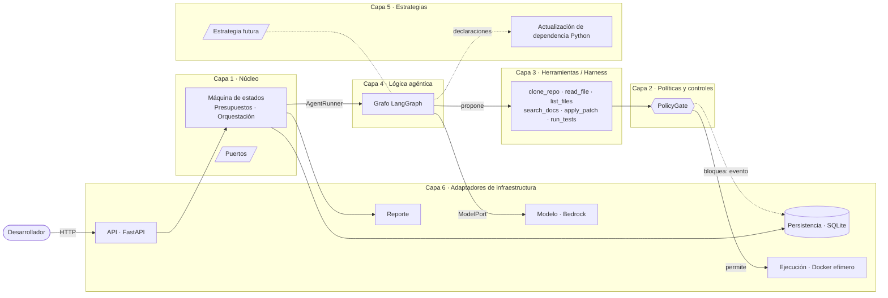
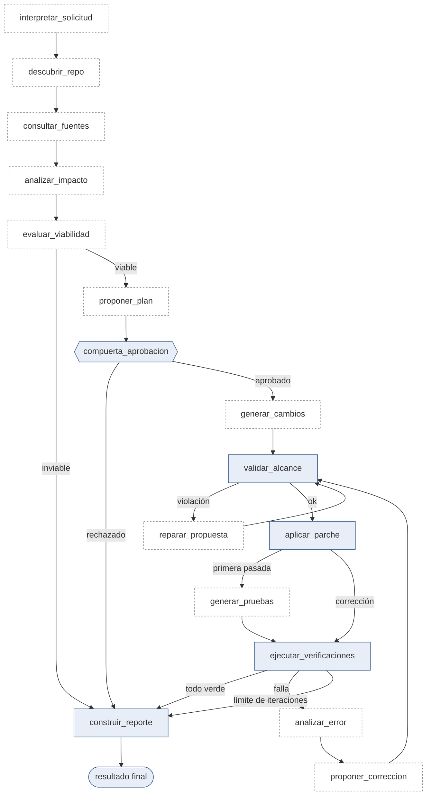

# 03 — Arquitectura

| | |
|---|---|
| **Estado** | **APROBADO** el 2026-09-28. Ajustes posteriores: el adaptador de modelo usa `boto3` (API Converse) en lugar de `langchain-aws` (`ADR-002`); `Sandbox` y `RunRepository` ganan un adaptador de nube (§9, `ADR-006`, `ADR-007`), promovido de F2 a F1 por D-9. |
| **Depende de** | `00-vision.md` (RN-xx, AC-xx) · `01-requisitos.md` (FR/NFR/C) |
| **Fecha** | 2026-09-28 |

Este documento fija las fronteras entre capas. El detalle de entidades y estados va en `02-modelo-entidades.md`; los controles, uno por uno, en `05-politicas-y-controles.md`; la interfaz de estrategia, en `06-estrategias.md`. Las decisiones con alternativas descartadas van en `ADR/`.

---

## 1. Idea central

> **El modelo propone; el código dispone.**

El modelo de lenguaje nunca actúa sobre el mundo. Emite **propuestas** (llamadas a herramientas, parches, planes). Un conjunto de componentes deterministas decide si cada propuesta se ejecuta, la ejecuta y captura el resultado real. Aunque el modelo estuviera totalmente comprometido por una inyección de instrucciones, lo peor que puede hacer es proponer algo que la capa de políticas rechaza y registra (RN-02, RN-03, RN-09).



Lectura: la línea sólida es el flujo de control; el modelo solo aparece a la derecha del grafo y sus salidas entran a las herramientas, que **solo** llegan al mundo exterior pasando por `PolicyGate`.

---

## 2. Las seis capas

El caso pide separar ocho componentes. Se agrupan en seis capas de dependencia (ver pregunta abierta 1 de `00-vision.md`):

| Capa | Paquete | Componentes del caso que cubre | Responsabilidad en una línea |
|---|---|---|---|
| **1. Núcleo** | `emh/core` | Núcleo de la plataforma | Dominio, máquina de estados, presupuestos, orquestación y **puertos** (interfaces). No conoce a nadie. |
| **2. Políticas y controles** | `emh/policy` | Políticas y controles | `PolicyGate`: controles deterministas, *deny by default*. |
| **3. Herramientas / Harness** | `emh/harness` | Herramientas / Harness | Herramientas con contrato tipado; cada una pasa por `PolicyGate`. |
| **4. Lógica agéntica** | `emh/agent` | Lógica agentic | Grafo LangGraph, nodos, prompts. Implementa `AgentRunner`. |
| **5. Estrategias** | `emh/strategies` | Estrategia de modernización | Declaran *qué* es una modernización concreta. Implementan `ModernizationStrategy`. |
| **6. Adaptadores** | `emh/api`, `emh/execution`, `emh/persistence`, `emh/reporting`, `emh/models` | Ejecución · Persistencia · Reporte (+ API y modelo) | Implementan los puertos del núcleo contra tecnologías concretas. |

### Regla de dependencias

```
                  emh/core   ← no importa de nadie (solo stdlib + pydantic)
                     ▲
   ┌─────────┬───────┼──────────┬──────────────┐
emh/policy  emh/strategies      │        emh/{api, execution, persistence, reporting, models}
   ▲                            │                        (implementan puertos del núcleo)
emh/harness  ← policy, core     │
   ▲                            │
emh/agent    ← harness, core ───┘

emh/bootstrap  ← raíz de composición: el único lugar que conoce a todos
```

- Las dependencias apuntan **hacia el núcleo**. `emh/core` no importa de ningún otro paquete de `emh`, ni `boto3`, `docker`, `sqlite3`, `fastapi` o `langgraph` (NFR-015, NFR-016).
- `emh/agent` no importa `emh/strategies` ni adaptadores: recibe las estrategias y el modelo por inyección.
- `emh/strategies` no importan `emh/agent`, `emh/harness` ni `emh/policy`: solo declaran datos definidos en el núcleo.
- Los adaptadores no se importan entre sí.
- **Se hace cumplir con `import-linter`** en la construcción: una violación rompe el build, no depende de disciplina.

### Puertos del núcleo (interfaces, no implementaciones)

| Puerto | Lo implementa | Función |
|---|---|---|
| `AgentRunner` | `emh/agent` | `run(run_id)`, `resume(run_id, decisión)`. El núcleo invoca al agente sin saber que es LangGraph. |
| `ModelPort` | `emh/models` (Bedrock) · `ScriptedModel` (pruebas, **SIMULADO**) | Completar/estructurar con el modelo, informando tokens consumidos. |
| `RunRepository` | `emh/persistence`: SQLite (local) · RDS Postgres (nube, `EMH_ENV=aws`) | Guardar y leer solicitudes, ejecuciones, planes, decisiones, fuentes, eventos. |
| `Sandbox` | `emh/execution`: Docker (local) · ECS Fargate `RunTask` (nube, `EMH_ENV=aws`) | Crear, ejecutar comandos en y destruir un contenedor efímero. |
| `ModernizationStrategy` | `emh/strategies/*` | Ver §5. |
| `ReportRenderer` | `emh/reporting` | Convertir los datos persistidos en el reporte. |

---

## 3. Especificación de cada capa

Cada capa sigue el contrato de seis secciones. Aquí se resumen; el detalle vive en los documentos indicados.

### 3.1 Capa 1 — Núcleo (`emh/core`)

1. **Problema y usuario.** La plataforma necesita un centro estable que no cambie cuando cambian modelos, herramientas o tipos de modernización. Usuarios: las demás capas.
2. **Datos y pantallas.** Entidades de dominio (`Solicitud`, `Ejecución`, `Plan`, `Decisión`, `Verificación`, `Fuente`, `EventoSeguridad`), estados y transiciones (`02-modelo-entidades.md`). Sin pantallas.
3. **No objetivos.** No contiene lógica de LLM, ni sabe qué es una dependencia, un framework o una imagen. No ejecuta comandos ni accede a disco o red.
4. **Reglas de negocio.**
   - *La máquina de estados del núcleo es la fuente de verdad del estado de la ejecución.* LangGraph guarda memoria de trabajo y flujo de control; **no** decide el estado. Cada nodo del grafo pide una transición al núcleo, que valida que sea legal. Una transición ilegal termina la ejecución en `FALLIDO_CONTROLADO` (RN-11).
   - `PresupuestoMeter` lleva tokens, tiempo de pared e iteraciones y lanza `PresupuestoAgotado` con corte duro, antes de cada llamada (RN-06, NFR-009).
   - Un plan aprobado se identifica por su hash y es inmutable (RN-16).
   - Toda ejecución termina en exactamente uno de cinco resultados (RN-11).
5. **Criterios de aceptación.** Transiciones ilegales rechazadas (prueba de tabla); presupuesto corta en el límite (prueba con reloj inyectado); `import-linter` verde; 0 imports de infraestructura.
6. **Preguntas abiertas.** Ver pregunta abierta 2 de `00-vision.md` sobre el terminal de rechazo e inviabilidad.

### 3.2 Capa 2 — Políticas y controles (`emh/policy`)

1. **Problema y usuario.** Nadie puede confiar en que un modelo "se comporte". Los controles críticos deben ser código. Usuarios: el harness (que los invoca) y el equipo de seguridad (que audita sus decisiones).
2. **Datos y pantallas.** Entrada: `Acción` propuesta + contexto de ejecución (plan aprobado, presupuesto, línea base de pruebas). Salida: `Decisión(permitir | denegar, regla, motivo)`. Los bloqueos se persisten como `EventoSeguridad`.
3. **No objetivos.** No usa un LLM para decidir nada. No "detecta" inyección para defenderse: la detección heurística es solo telemetría; la defensa es que lo no permitido se rechaza.
4. **Reglas de negocio.** Los ocho controles del caso, todos deterministas y *deny by default* (`05-politicas-y-controles.md`):

   | Control | Qué garantiza |
   |---|---|
   | Permisos | El agente solo puede invocar las herramientas registradas, con los argumentos que cumplen su contrato. |
   | Comandos permitidos | Allowlist estricta; sin shell libre; argumentos como lista, nunca cadenas interpretadas. |
   | Rutas modificables | Solo las declaradas en el plan aprobado; rutas resueltas y confinadas al workspace (sin `..` ni enlaces simbólicos que escapen). |
   | Presupuestos | Corte duro de tokens, tiempo e iteraciones. |
   | Aprobaciones | Sin decisión `APROBADO` ligada al hash del plan vigente, `apply_patch` se rechaza. |
   | Manejo de secretos | Redacción por patrones en toda salida de herramienta; el contenedor no recibe credenciales. |
   | Validación del alcance | El diff completo se valida contra el plan antes de aplicarse (rutas, tipo de operación, sin borrado de pruebas). |
   | Confirmación de pruebas | El veredicto sale del código de salida y del reporte parseado capturados; conteo de pruebas ≥ línea base; sin `skip`/`xfail` nuevos. |

   Las estrategias **declaran**, la política **decide**: una estrategia puede pedir comandos o rutas, pero la política los intersecta con la línea base global; una estrategia puede restringir, nunca ampliar.
5. **Criterios de aceptación.** Prueba unitaria por control con casos permitidos y denegados; NFR-002 (ningún camino a efectos sin compuerta); cada bloqueo genera un evento (NFR-013); AC-04 a AC-08 de `00-vision.md`.
6. **Preguntas abiertas.** Patrones de redacción de secretos: lista inicial propia frente a librería de detección (a decidir en `05`).

### 3.3 Capa 3 — Herramientas / Harness (`emh/harness`)

1. **Problema y usuario.** El modelo necesita manos para explorar y modificar, pero cada mano debe tener un contrato explícito. Usuario: la capa agéntica.
2. **Datos y pantallas.** Seis herramientas, cada una con esquema de entrada y salida validado (pydantic):

   | Herramienta | Dónde corre | Efecto | Nota |
   |---|---|---|---|
   | `clone_repo` | Host | Escribe el workspace | Solo HTTPS y hosts de una allowlist; git sin hooks ni submódulos. |
   | `list_files` | Host | Lectura | Confinada al workspace. |
   | `read_file` | Host | Lectura | Confinada al workspace; tamaño máximo; salida redactada y marcada como no confiable. |
   | `search_docs` | Host | Red (lectura) | Solo dominios de fuentes oficiales declarados por la estrategia; cada resultado se persiste como `Fuente`. |
   | `apply_patch` | Host | Escribe el workspace | Solo tras aprobación y validación de alcance. |
   | `run_tests` | **Contenedor** | Ejecuta código del repositorio | Comandos de la allowlist únicamente. |

3. **No objetivos.** No hay herramienta genérica de shell, de escritura libre de archivos ni de red libre.
4. **Reglas de negocio.** Toda herramienta: (a) valida argumentos contra su contrato antes de cualquier efecto; (b) consulta `PolicyGate` **dentro** de la herramienta, no en un paso previo omitible del grafo; (c) devuelve salida redactada y etiquetada como contenido no confiable; (d) registra la llamada (NFR-014). Los errores de herramienta vuelven al modelo como resultados estructurados, no como excepciones.
5. **Criterios de aceptación.** NFR-002; argumentos inválidos rechazados sin efecto; intento de escapar del workspace bloqueado.
6. **Preguntas abiertas.** Ninguna bloqueante.

### 3.4 Capa 4 — Lógica agéntica (`emh/agent`)

1. **Problema y usuario.** El trabajo cognitivo (entender, investigar, planear, escribir, diagnosticar) lo hace el modelo dentro de un flujo con estructura. Usuario: el desarrollador, indirectamente.
2. **Datos y pantallas.** Grafo LangGraph con memoria de trabajo (mensajes, notas) y *checkpointer* SQLite para retomar. El grafo se dibuja en §4.
3. **No objetivos.** No decide permisos, comandos, rutas, presupuestos, aprobaciones ni si una prueba pasó (RN-02). No conoce estrategias concretas: recibe las que se le inyectan.
4. **Reglas de negocio.** El flujo de estados es fijo y lo impone el grafo más el núcleo; el modelo decide *qué* investigar, *qué* cambiar y *cómo* corregir dentro de él. Antes de cada llamada al modelo se consulta el presupuesto. La aprobación es una interrupción (`interrupt`) del grafo: se reanuda solo cuando el núcleo registra una decisión.
5. **Criterios de aceptación.** AC-03 (sin modelo no hay modernización); AC-02 (participación sustancial del modelo, en `08-uso-de-ia.md`); reanudación tras reinicio del proceso.
6. **Preguntas abiertas.** Ninguna bloqueante.

### 3.5 Capa 5 — Estrategias (`emh/strategies`)

1. **Problema y usuario.** Cada tipo de modernización tiene sus particularidades; el producto no debe reescribirse para cada una. Usuario: el operador de plataforma que añade estrategias.
2. **Datos y pantallas.** Una estrategia es un objeto que implementa `ModernizationStrategy` y devuelve **declaraciones** (datos): a qué objetivos aplica, qué fuentes oficiales son válidas, qué comandos de instalación y verificación usa, qué señales buscar en el repositorio, qué instrucciones específicas aporta al modelo (ver §5).
3. **No objetivos.** Una estrategia no ejecuta nada por sí misma, no toca disco, red ni contenedor, y no puede ampliar la política global.
4. **Reglas de negocio.** El núcleo, el agente y el harness no importan estrategias concretas; se resuelven por identificador desde un registro poblado en `bootstrap` (RN-13). F1 trae una: `python_dependency_upgrade`.
5. **Criterios de aceptación.** NFR-015: una estrategia ficticia definida en las pruebas se registra y ejecuta con 0 líneas modificadas en `emh/core`.
6. **Preguntas abiertas.** Descubrimiento de estrategias: registro explícito en `bootstrap` (F1, simple) frente a *entry points* (F2, plugins externos).

### 3.6 Capa 6 — Adaptadores de infraestructura

| Adaptador | Implementa | Detalle |
|---|---|---|
| `emh/api` | Entrada HTTP | FastAPI. Endpoints de `00-vision.md` §2. Traduce HTTP a llamadas al núcleo; no contiene lógica de negocio. La ejecución corre en segundo plano; el cliente consulta por sondeo. |
| `emh/execution` | `Sandbox` | Docker efímero (local) **o** ECS Fargate `RunTask` (nube). Ver §6 y §9. |
| `emh/persistence` | `RunRepository` | SQLite (local) **o** RDS Postgres (nube). Un solo escritor por ejecución en ambos; el esquema evita cualquier detalle específico del motor en el dominio. |
| `emh/reporting` | `ReportRenderer` | Reporte en dos partes (§7). |
| `emh/models` | `ModelPort` | Amazon Nova 2 Lite en Bedrock, con `boto3` y la API Converse (*tool use*, conteo exacto de tokens). `ScriptedModel` para pruebas de controles, marcado `SIMULATED`. |

Criterios de aceptación comunes: cada adaptador tiene una prueba de contrato contra su puerto; cambiar de adaptador no modifica el dominio (NFR-016).
Preguntas abiertas: ver §8.

---

## 4. Flujo agéntico

El flujo de negocio del caso —Solicitud → Descubrimiento → Análisis de impacto → Plan y viabilidad → Aprobación → Generación de cambios → Pruebas y verificaciones → Reporte— se implementa como un grafo. Los nodos **sombreados** los decide código; los demás piden trabajo al modelo.



Puntos de diseño:

- **Bucle de reparación por violación de alcance.** Cuando `validar_alcance` rechaza un parche, devuelve al modelo el conjunto preciso de violaciones para que reformule, dentro del mismo presupuesto. Es el patrón "el modelo propone, un verificador determinista certifica o devuelve el conjunto de conflictos" que describe la guía (cap. 9).
- **Bucle de corrección de pruebas.** El ciclo `ejecutar_verificaciones → analizar_error → proponer_correccion → validar_alcance → aplicar_parche → ejecutar_verificaciones` cuenta contra el límite de iteraciones. Al agotarse, la ejecución termina con el mejor resultado honesto (`COMPLETADO_PARCIALMENTE` o `PRESUPUESTO_AGOTADO`), nunca "exitosa".
- **Toda arista del grafo pasa por el núcleo.** Cada nodo solicita una transición; la máquina de estados del núcleo la valida (§3.1).
- **`construir_reporte` es un nodo determinista** que ensambla los hechos persistidos; el modelo solo redacta el resumen narrativo (§7).

---

## 5. Cómo se agrega una segunda estrategia sin modificar el núcleo

Es el punto que el caso pide demostrar explícitamente. El diseño lo respalda con una interfaz pequeña que solo devuelve **declaraciones**:

```python
class ModernizationStrategy(Protocol):
    id: str                                              # p. ej. "python_dependency_upgrade"

    def supports(self, request: Solicitud) -> Soporte: ...          # ¿aplica a este objetivo?
    def discovery_signals(self) -> list[Senal]: ...                 # qué buscar en el repo (manifiestos, versiones)
    def official_sources(self, request) -> list[DominioFuente]: ... # dominios válidos para search_docs
    def command_profile(self) -> PerfilComandos: ...                # instalación y verificación que necesita
    def scope_template(self, plan_hint) -> PlantillaAlcance: ...    # rutas y operaciones típicas
    def prompt_pack(self) -> PaqueteInstrucciones: ...              # instrucciones específicas para el modelo
```

Para añadir, por ejemplo, la estrategia de **imagen base** (F2):

1. Crear `emh/strategies/base_image.py` implementando `ModernizationStrategy` (declara `Dockerfile` como señal, registros de imágenes como fuentes, `docker build` como comando de verificación).
2. Añadir **una línea** de registro en `emh/bootstrap.py`.
3. Si necesita un comando nuevo, se añade a la allowlist **global** de `emh/policy` como una decisión explícita y revisable, no desde la estrategia.

Qué **no** se toca: `emh/core`, `emh/agent`, `emh/harness`. El grafo, la máquina de estados, los presupuestos y la compuerta de aprobación son idénticos. La prueba que lo demuestra: una estrategia ficticia definida solo en el directorio de pruebas se registra y recorre el flujo completo (NFR-015). Detalle y ejemplo completo en `06-estrategias.md`.

Por qué funciona: la estrategia describe *qué* es la modernización; el agente decide *cómo* investigarla; la política decide *qué está permitido*; el núcleo decide *cuándo* se puede avanzar. Cuatro responsabilidades, cuatro dueños.

---

## 6. Ejecución aislada

Todo código del repositorio objetivo se ejecuta dentro de un contenedor efímero (RN-15, C-005). El código del repositorio es, por definición, no confiable: un `conftest.py` malicioso podría intentar leer el entorno o llamar a la red.

- **Un contenedor y un workspace por ejecución.** Se crean al iniciar, se destruyen al terminar (NFR-004, NFR-020).
- **Endurecimiento.** Usuario no root, sin capacidades adicionales, sistema de archivos raíz de solo lectura salvo el workspace montado, límites de CPU y memoria, sin variables de entorno de credenciales.
- **Dos fases de red.**
  1. *Instalación de dependencias:* acceso solo a los hosts de la allowlist del registro de paquetes.
  2. *Pruebas:* **sin red** (NFR-005).
- **Lo que corre en el host y lo que corre en el contenedor.** El host hace `clone_repo`, `list_files`, `read_file`, `search_docs` y `apply_patch` (operaciones acotadas y validadas). Solo `run_tests` ejecuta código del repositorio, y lo hace en el contenedor.

**Riesgo técnico abierto — cómo imponer la allowlist de red en la instalación.** Docker no ofrece nativamente "solo estos hosts". Opciones: (a) contenedor de instalación con un proxy de allowlist; (b) *wheelhouse*: el host descarga las ruedas con `pip download --only-binary=:all:` (sin ejecutar `setup.py`) y el contenedor instala con `--no-index --find-links`, quedando sin red en ambas fases. *Propuesta:* (b), porque reduce la superficie a cero red dentro del contenedor y es fácil de probar. Limitación conocida: paquetes sin rueda binaria no se pueden instalar; el flujo devuelve `BLOQUEADO` con motivo explícito. Se decide en un ADR antes de implementar la capa de ejecución.

---

## 7. Persistencia y reporte

**Persistencia (SQLite detrás de `RunRepository`).** Tablas para solicitudes, ejecuciones, planes (con hash), decisiones, fuentes, verificaciones, llamadas (modelo y herramientas) y eventos de seguridad. Cada bloqueo se escribe en la misma transacción que produce la respuesta de bloqueo (NFR-013). El *checkpointer* de LangGraph usa el mismo archivo pero **no** es fuente de verdad del estado de negocio (§3.1).

**Reporte.** Dos partes con dueños distintos, para que el modelo no pueda maquillar los hechos:

| Parte | Quién la produce | Contenido |
|---|---|---|
| **Hechos** | Código determinista, desde la base de datos | Resultado final, cambios (diff), verificaciones con su salida capturada, presupuesto consumido, fuentes, eventos de seguridad. |
| **Narrativa** | Modelo | Resumen y explicación de decisiones, cada una citando IDs de fuentes. Marcada como "redactada por IA". |

Toda afirmación de la narrativa sin fuente asociada se marca "sin sustento" (RN-12). Una verificación solo aparece como exitosa si existe su salida capturada (AC-08).

---

## 8. Pruebas de la arquitectura

| Nivel | Modelo | Qué demuestra | Marca |
|---|---|---|---|
| **A — Controles** | `ScriptedModel` (**SIMULADO**, adversarial cuando corresponde) | Que la capa de políticas frena cualquier propuesta indebida, sin depender del comportamiento del modelo. Determinista, corre en cada commit. | `@pytest.mark.simulated` |
| **B — En vivo** | Bedrock real | Que el flujo completo funciona con el modelo real: los cuatro escenarios sobre el repositorio de la demo. | `@pytest.mark.live` |

Los **invariantes** de seguridad (NFR-001, NFR-003, NFR-006) se verifican en ambos niveles, incluida una ejecución en vivo con contenido malicioso incrustado en el repositorio: no se afirma qué hará el modelo, se afirma que, haga lo que haga, no hay efecto (RN-14: el nivel A se rotula como simulación en el código y en el `README.md`).

## 9. Despliegue en la nube (D-9, `ADR-006`, `ADR-007`)

> **Estado real (2026-09-29): el código de F1 implementa solo los adaptadores **locales** (`DockerSandbox` + `SqliteRunRepository`); `PostgresRunRepository`, `FargateSandbox` y la selección por `EMH_ENV` están **diseñados pero NO implementados** (NOT IMPLEMENTED). Lo entregado y verificado de la parte de nube es la infraestructura como código: `terraform validate` y `terraform plan` reales contra la cuenta AWS (33 recursos a crear), sin `terraform apply`.**

Diseño (promovido de F2 a F1, con la parte de código pendiente). El despliegue **no** reemplaza el camino local: es un segundo adaptador de los mismos dos puertos que ya existían, seleccionado por una variable de entorno (`EMH_ENV=local|aws`) en `emh/bootstrap.py`. Esto es, en sí mismo, la prueba en producción de NFR-016 (portabilidad): si el diseño de puertos fuera solo teórico, este cambio habría exigido tocar el núcleo; no lo exige.

```
EMH_ENV=local   → DockerSandbox + SQLiteRunRepository   (IMPLEMENTADO: dev, CI, demo en vivo)
EMH_ENV=aws     → FargateSandbox + PostgresRunRepository (DISEÑADO, no implementado)
```

| Elemento | Adaptador de nube | Reemplaza a |
|---|---|---|
| `Sandbox` | `FargateSandbox` (`boto3` ECS `run_task`, una tarea efímera por ejecución) | `DockerSandbox` |
| `RunRepository` | `PostgresRunRepository` (`psycopg`, mismo esquema de `02-modelo-entidades.md`) | `SqliteRunRepository` |
| Infraestructura | Terraform (`infra/`), *provider* `hashicorp/aws ~> 6.66`: VPC de una subred pública (sin NAT), ECS Fargate (API + tarea de sandbox), RDS `db.t4g.micro`, SSM Parameter Store, AWS Budgets | — |

Decisiones de costo (ECS/Fargate sin balanceador ni NAT, RDS de instancia simple frente a DynamoDB/Aurora Serverless v2, SSM frente a Secrets Manager) y su justificación completa están en `ADR-006` y `ADR-007`, no se repiten aquí. El camino local sigue siendo el que se usa para las pruebas de nivel A/CI (correr contra AWS en cada prueba no tiene sentido de costo ni de velocidad) y el respaldo si el despliegue de nube tuviera algún problema durante la sustentación en vivo (C-011).

## 10. Estructura del paquete

```
emh/
  core/          dominio, máquina de estados, presupuestos, puertos
  policy/        PolicyGate y los ocho controles
  harness/       contratos y herramientas
  agent/         grafo LangGraph, nodos, prompts
  strategies/    python_dependency_upgrade
  models/        BedrockModel · ScriptedModel (SIMULADO)
  execution/     DockerSandbox · FargateSandbox
  persistence/   SQLiteRunRepository · PostgresRunRepository
  reporting/     ReportRenderer
  api/           FastAPI
  bootstrap.py   raíz de composición
infra/
  network/  ecs/  rds/  budget/   (módulos Terraform, provider hashicorp/aws ~> 6.66)
tests/
  unit/  contract/  scenarios/  (simulated + live)
```

---

## Preguntas abiertas

Resueltas el 2026-09-28 (ver `00-vision.md`, *Decisiones tras la aprobación*), salvo la 5 y la 6, que se resuelven en sus documentos correspondientes:

1. ~~Seis capas vs. ocho componentes~~ — D-1, se mantiene la agrupación de §2.
2. ~~Terminales de rechazo e inviabilidad~~ — D-2, `BLOQUEADO` con `motivo`; ver `02-modelo-entidades.md`.
3. ~~Allowlist de red en la instalación~~ — D-6, wheelhouse; ver §6.
4. ~~Acceso y modelo de Bedrock~~ — D-3, Amazon Nova 2 Lite (`us.amazon.nova-2-lite-v1:0`), acceso verificado. Ver `ADR/ADR-002`.
5. **Concurrencia de SQLite** — un escritor por ejecución basta para F1 (NFR-020 exige 2 ejecuciones concurrentes); se confirma en la prueba de aislamiento al implementar `emh/persistence`.
6. **Redacción de secretos** — lista propia de patrones frente a librería de detección; se decide en `05-politicas-y-controles.md`.
